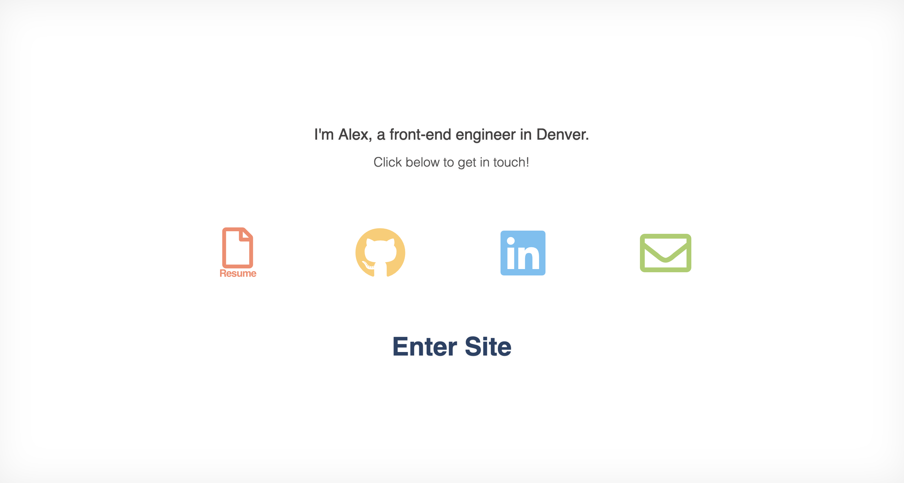
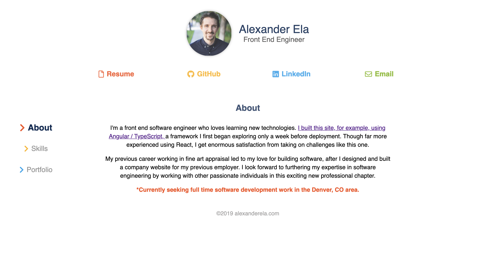
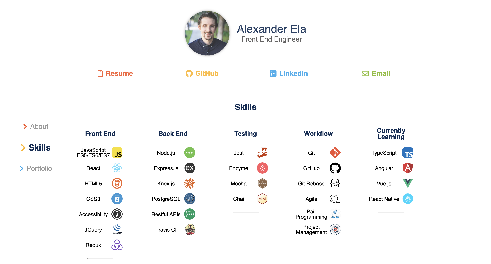
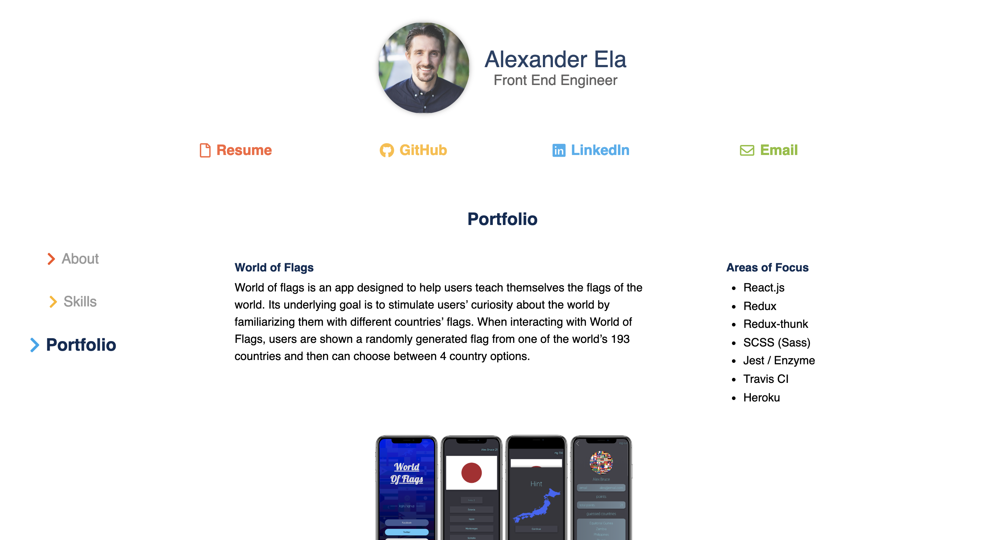
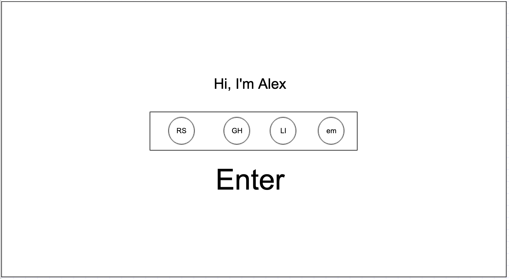
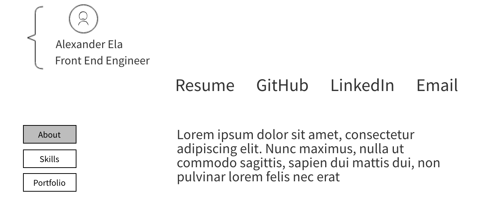
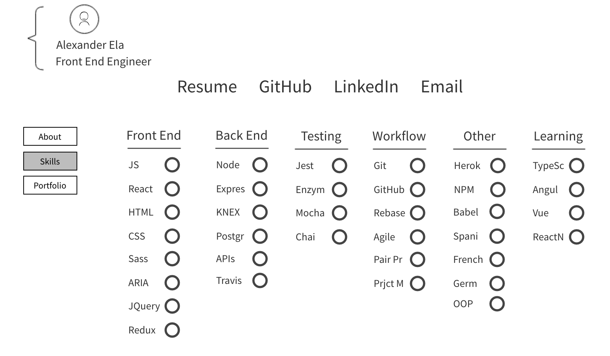
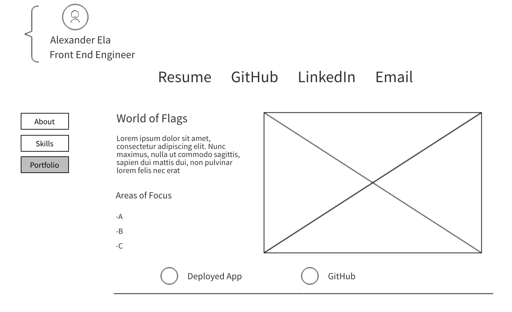

[](https://waffle.io/alexanderela/personal-website)

# PersonalWebsite
This is my personal/professional site for my software engineering portfolio.  Enjoy!

## Deployed App
[www.alexanderela.com](https://alexanderela.com/)

## Getting Started
This is a general guide to setting up a Recharge API development environment on your local machine.

### Dependencies
* Angular
* TypeScript
* See package.json for a list of required modules

### Developers:
#### Get the app on your local machine
* Fork this repo using the `Fork` button in the upper right corner of this page.

* `Clone` your fork onto your local machine
```
git clone https://github.com/YOUR_GITHUB_USERNAME_HERE/palette-picker
```

* Jump into that directory on your local machine
```
cd palette-picker
```

* Add an upstream remote that points to the main repo:
```
git remote add upstream https://github.com/alexanderela/palette-picker.git
```

* Fetch the latest version of `master` from `upstream`
```
git fetch upstream master
```

This project was generated with [Angular CLI](https://github.com/angular/angular-cli) version 7.3.1.

#### Development server

Run `ng serve` for a dev server. Navigate to `http://localhost:4200/`. The app will automatically reload if you change any of the source files.

#### Code scaffolding

Run `ng generate component component-name` to generate a new component. You can also use `ng generate directive|pipe|service|class|guard|interface|enum|module`.

#### Build

Run `ng build` to build the project. The build artifacts will be stored in the `dist/` directory. Use the `--prod` flag for a production build.

#### Further help

To get more help on the Angular CLI use `ng help` or go check out the [Angular CLI README](https://github.com/angular/angular-cli/blob/master/README.md).

## Contributing
This guide assumes that the git remote name of the main repo is `upstream` and that **your** fork is named `origin`.

Create a new branch on your local machine to make your changes against (based on `upstream/master`):
```
git checkout -b branch-name-here --no-track upstream/master
```
We recommend naming your branch using the following convention:
```
#(issueNumber)-feature-name-your-name
ex: 36-middleware-error-handling-alex
```

### Contribute using GitHub Issues
* Click on the `Issues` tab at the top left of this page
* Choose one and work on your local machine to fix it  
  - We recommend naming your branch according to the above convention  
  - Use TDD as much as possible 
  - Once the tests are passing, you can commit your changes. See [Making a great commit for more tips](https://github.com/openfoodfoundation/openfoodnetwork/wiki/Making-a-great-commit).  
```
git add .
git commit -m "Add a concise commit message describing your change here"
```
  - Before pushing to your fork, rebase your commits against the upstream master branch
```
git pull --rebase upstream master
```
  - Push your changes to a branch on your fork:
```
git push origin branch-name-here
```

### Submitting a Pull Request
* Create a Pull Request (PR) to this repo's master using GitHub's UI
* Fill in the requested information re: what you worked on
* Keep your PR small, with a single focus

## Technologies Used
- Angular
- TypeScript
- CSS3

## Images:
### Landing Page


### About Page


### Skills Page


### Portfolio Page



## Wireframes:
### Landing Page Wireframe


### About Page Wireframe


### Skills Page Wireframe


### Portfolio Page Wireframe


## This README relied upon Open Food Source's extensive and excellent [Set Up](https://github.com/openfoodfoundation/openfoodnetwork/blob/master/GETTING_STARTED.md) and [Contibution](https://github.com/openfoodfoundation/openfoodnetwork/blob/master/CONTRIBUTING.md) docs.
